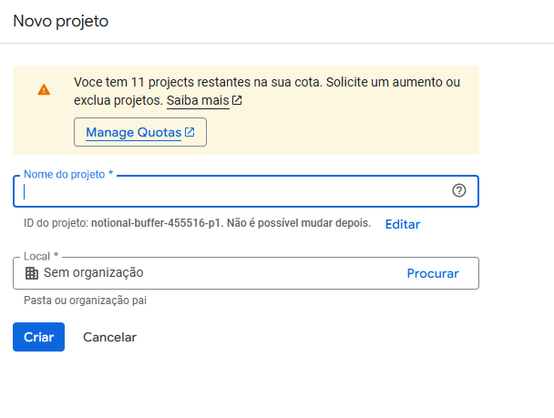
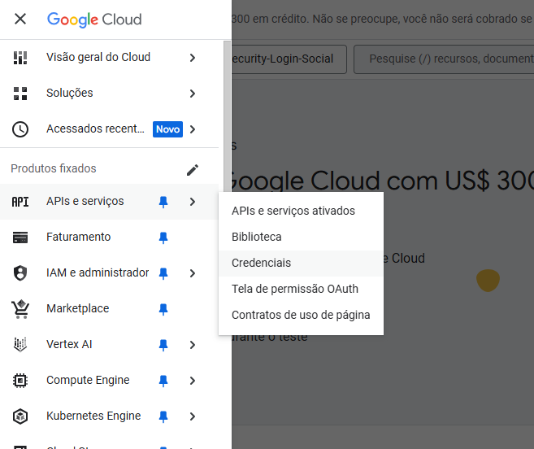
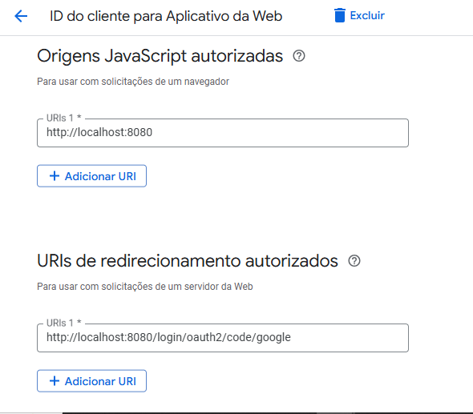
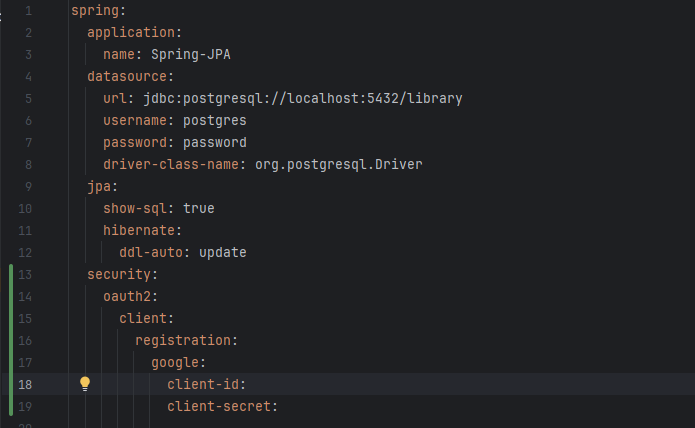
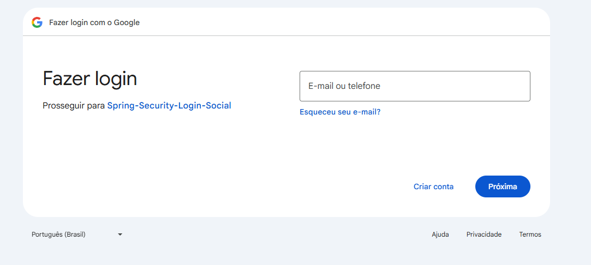
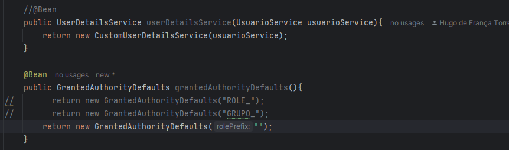
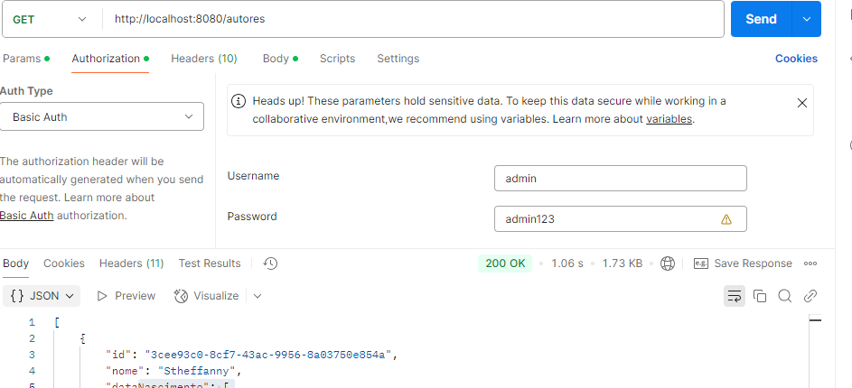

# Spring-Security Login-Social

  - [Tecnologias Usadas](#Tecnologias-Usadas)
  - [Sobre](#Sobre)
  - [Inicio](#Inicio)
  - [Configurações](#Configurações)

  
## Tecnologias Usadas

[Java](https://www.java.com/pt-BR/) / [Spring](https://spring.io/projects/spring-boot) / [Docker](https://www.docker.com/) / [PostgresSQL](https://www.postgresql.org/) / [Pgadmin4](https://www.pgadmin.org/download/pgadmin-4-windows/) / [Thymeleaf](https://www.thymeleaf.org/) / [HTML5](https://pt.wikipedia.org/wiki/HTML5)
 / [Postman](https://www.postman.com/) / [Google Cloud](https://cloud.google.com/?hl=pt-BR)

 ## Sobre

 Se aprofundando em Spring Security com configurações avançadas e associando projeto local ao google cloud com login social. Este projeto é uma continuação de [Spring-Security](https://github.com/Hugoftf/Spring-Security).

 ## Inicio

Para associarmos o projeto ao google cloud, no site depois de criar a conta no google cloud, iremos criar um novo projeto no console da pagina principal:

Depois de criar e configurar,  vá em credenciais:

Para configurar a url do projeto local e a url de redirecionamento:

Quando você terminar de configurar, ele retornar duas chaves para que você possa associar com seu projeto

Partindo para o Spring, iremos adicionar o starter do Oauth2:

E também iremos editar nosso arquivo applicaiton.yml adicionando a camada security com oauth para associar ao google:

Os campos client-id e secret irão receber os ids gerados no site do google cloud para serem associados com nosso projeto local. Agora nosso Bean do SecurityFilterChain, iremos adicionar o Oauth2:

Comentei a tela de login que fizemos com o HTML para testarmos com o padrão, o retorno foi o:

Quando tentando logar com o google:

Conseguirmos associar com nosso projeto, porém não conseguimos authenticar o login do google por que precisamos de configurações adicionais no nosso projeto. Com isso precisamos modificar nosso projeto de autenticação que está como padrão.

## Configurações

Por padrão, arquitetos de Spring Security recomenda que você faça suas próprias Authentication ao invés de usar recursos provido do Spring, assim você tem uma maior flexibilidade para gerar sua aplicação, para isso vamos criar a classe Authentication:

Ela vai implementar a interface Authentication, logo precisaremos sobrescrever seus metodos. A classe tem uma dependencia com Usuario, que nesse constesto vai servi para realizar as Autenticação através dos metodos sobrescrito.

Metodos:

O primeiro metodo do tipo GrantedAuthority, é com ele que retornaremos as Roles do nosso usuario, então precisamos entrar no usuario e dar um Get nas roles.

O segundo metodo por agora não alternada.

O terceiro e quarto metodo básicamente retornar informações sobre o usuario.

No metodo isAthentication sempre deixe marcado como true, para que ele sempre esteja authenticado.

Agora precisamos criar a classe AuthenticationProvider:

Ela será responsável por processar a autenticação de um usuário. Ela recebe uma solicitação de autenticação, verifica as credenciais e retorna um objeto Authentication se a autenticação for bem-sucedida. Por isso anotamos com o @Component para ser genreciada pelo spring, servirar como uma Bean. Ela tem dependencia com UsuarioService e PasswordEconder para autenticar o usuario.

Sobrescrivendo dois metodos, o primeiro authentication vai servi para para authenticar o usuario, já o segundo o Authenticaiton que vem como parametro é o usuario autenticado no primeiro metodo, entao retornarmos isAssignableFrom, com a classe UserNamePasswordAuthenticationToken para dizer que está autenticado.

Com isso no nosso config_security, vamos desabilitar nosso bean criado para autenticar por padrão, e adicionar mais um Bean que vai servi para desligar role prefix, como a autenticação estava como padrão, no sistema, quando cadastravamos uma role para usuario ela ficava nesse formato "ROLE_ADMIN", por que o spring espera que quando fazemos a autenticação do login senha com sucesso, e o usuario  tentar operar algum metodo de requisição, ele vai pegar sua role nesse padrão e checar, e como implementamos uma autenticação manual, retornaria um não autorizado:

Com isso ao iniciar e testar no postman o retorno:

