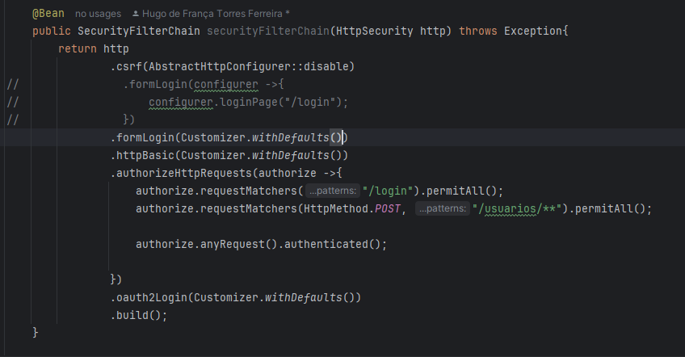

# Spring-Security Login-Social

  - [Tecnologias Usadas](#Tecnologias-Usadas)
  - [Sobre](#Sobre)
  - [Inicio](#Inicio)

  
## Tecnologias Usadas

[Java](https://www.java.com/pt-BR/) / [Spring](https://spring.io/projects/spring-boot) / [Docker](https://www.docker.com/) / [PostgresSQL](https://www.postgresql.org/) / [Pgadmin4](https://www.pgadmin.org/download/pgadmin-4-windows/) / [Thymeleaf](https://www.thymeleaf.org/) / [HTML5](https://pt.wikipedia.org/wiki/HTML5)
 / [Postman](https://www.postman.com/) / [Google Cloud](https://cloud.google.com/?hl=pt-BR)

 ## Sobre

 Se aprofundando em Spring Security com configurações avançadas e associando projeto local ao google cloud com login social.

 ## Inicio

Para associarmos o projeto ao google cloud, no site depois de criar a conta no google cloud, iremos criar um novo projeto no console da pagina principal:

Depois de criar e configurar,  vá em credenciais:

Para configurar a url do projeto local e a url de redirecionamento:

Quando você terminar de configurar, ele retornar duas chaves para que você possa associar com seu projeto

Partindo para o Spring, iremos adicionar o starter do Oauth2:

E também iremos editar nosso arquivo applicaiton.yml adicionando a camada security com oauth para associar ao google:

Os campos client-id e secret irão receber os ids gerados no site do google cloud para serem associados com nosso projeto local. Agora nosso Bean do SecurityFilterChain, iremos adicionar o Oauth2:

Comentei a tela de login que fizemos com o HTML para testarmos com o padrão, o retorno foi o:

Quando tentando logar com o google:

